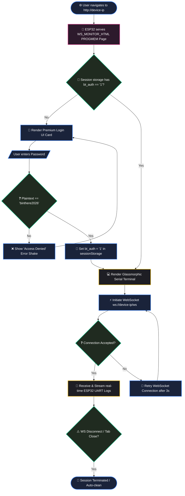

# BinThere — Smart Waste Intelligence Dashboard

[](https://www.apache.org/licenses/LICENSE-2.0)
[](package.json)
[](https://nodejs.org/)
[](https://react.dev/)
[](https://www.espressif.com/)

BinThere is a high-performance, real-time monitoring ecosystem designed for smart waste management. It utilizes ESP32-bound ultrasonic sensors to track fill levels in dual-compartment bins (**Dry Waste** and **Wet Waste**), providing actionable insights through a premium **"Frosted Control Room"** web dashboard and native desktop client.

> [!IMPORTANT]
> **Design Language**: The system is exclusively optimized for a **Dark Glassmorphic** aesthetic, utilizing modern CSS tokens, kinetic shimmer effects, and industrial-grade visual telemetry.

> [!TIP]
> **No hardware? No problem.** Use the included simulation utility to test the full-stack dashboard immediately.

---

## 💎 Core Capabilities

### 🖥️ Native Desktop Client

* **Standalone Executable**: Fully packaged Windows `.exe` utilizing an Electron wrapper for native performance without requiring a web browser.
* **Automated CI/CD Pipeline**: Custom PowerShell scripts (`release.ps1`) for seamless version bumping, source code syncing, and automated GitHub Release publishing.
* **Isolated Environment**: Runs the Node.js backend and better-sqlite3 database entirely in the background via packaged resources, ensuring zero-config deployments for end-users.

### 📡 Real-Time Monitoring

* **WebSocket Synchronization**: Live updates are pushed to the dashboard on every sensor trigger—no manual refreshing required.
* **Dual-Compartment Visualization**: Individual high-resolution vertical fill gauges (110px height) for Dry and Wet waste categories.
* **Dynamic Status Indicators**: Intelligent color-coding (Green → Yellow → Red Alert) based on industry-standard waste density thresholds.
* **Notification Engine**: Integrated alert system (visual badge + toast notifications) for compartments exceeding 80% capacity.
* **Industrial Modals**: High-fidelity glassmorphic dialogs for adding or editing bins with instant state propagation.

### 📊 Advanced Analytics

* **Fill-Cycle Intelligence**: Automatically detects and records "Fill Events" when a bin is emptied and subsequently refilled.
* **Fleet Utilization Trends**: A fluid, cubic-Bezier smoothed 7-day historical chart tracking aggregate fill levels across the entire bin network.
* **Peak Hours Heatmap**: A 24x7 density matrix visualizing waste accumulation patterns throughout the week.
* **Precise History**: Deep-dive into the last 50 measurements for any specific bin with micro-trendline visualizations.

### 🧠 Edge AI & Image Classification

* **Master Brain Integration**: Raspberry Pi Zero 2W pipeline for motion-triggered image capture via OpenCV.
* **Intelligent Routing**: Integrates AWS Bedrock's LLM capabilities alongside local OpenCV pipelines for highly accurate, automated waste classification and servo-driven bin routing.
* **Telemetry Relay**: Real-time UART bridge between Pi Zero and ESP32 for coordinated sensing and actuation.
* **ML Sandbox**: Local FastAPI server mock for testing image classification logic without live hardware.

### 📤 Data Portability

* **Excel Intelligence**: Premium executive reports with IST timestamping, KPI summaries, predictive maintenance forecasting, and recursive data tracking.
* **Date-Range Filtering**: Export specific temporal windows using one-tap presets (Today, 7D, 30D) or custom date pickers.

---

## 📊 System Architecture

The following diagram illustrates the end-to-end telemetry and control network of the BinThere ecosystem. It spans from edge-layer hardware and local machine-learning classifications to standard WebSockets and a dedicated glassmorphism React dashboard bundled within a native desktop runtime.

```mermaid
flowchart TB
    %% Core Nodes & Classes
    subgraph ClientSpace ["💻 Client Space (Desktop App / Web Browser)"]
        direction LR
        Electron["📦 Electron Wrapper<br/>(Native Runtime)"]
        ReactUI["🎨 React 18 SPA (Vite)<br/>'Frosted Control Room'"]
        Preload["🔗 Secure Preload Bridge<br/>(IPC Renderer)"]
        
        Electron <-->|IPC / contextBridge| Preload
        Preload <--> ReactUI
    end

    subgraph ServerSpace ["🖥️ Server Space (Local or Remote Node Host)"]
        Express["🚂 Express Web Server<br/>(Node.js server.js)"]
        WS["⚡ WebSocket Server (ws)<br/>(Real-Time Broadcast)"]
        SQLite[("🗄️ SQLite Database<br/>(better-sqlite3)")]
        Excel["📊 ExcelJS Engine<br/>(IST-Localized Reports)"]
        
        Express <--> WS
        Express <--> SQLite
        Express ---> Excel
    end

    subgraph EdgeSpace ["🤖 Edge IoT Space (Physical Hardware / ML Core)"]
        ESP32["🔌 ESP32 Microcontroller<br/>(Arduino Core C++)"]
        PiZero["🧠 Raspberry Pi Zero 2W<br/>(ML Master Brain)"]
        Sensors["📡 Sensors<br/>(HC-SR04, VL53L0X, Soil)"]
        Actuators["⚙️ Actuators<br/>(SG90, MG995 Servos)"]
        
        PiZero <-->|UART Serial Bridge| ESP32
        ESP32 <--> Sensors
        ESP32 <--> Actuators
    end

    %% Network & Protocol Bridges
    ReactUI <-->|HTTP REST / JWT| Express
    ReactUI <-->|ws:// dynamic connection| WS
    ESP32 -->|POST /api/bins/:id/measurement<br/>(Device API Key)| Express
    
    %% Styles & Theme
    classDef client fill:#1a233a,stroke:#3b82f6,stroke-width:2px,color:#fff,round:20px;
    classDef server fill:#1e1e24,stroke:#10b981,stroke-width:2px,color:#fff;
    classDef edge fill:#2d1a2c,stroke:#ec4899,stroke-width:2px,color:#fff;
    classDef database fill:#1c2d37,stroke:#eab308,stroke-width:2px,color:#fff;
    
    class Electron,ReactUI,Preload,ClientSpace client;
    class Express,WS,Excel,ServerSpace server;
    class ESP32,PiZero,Sensors,Actuators,EdgeSpace edge;
    class SQLite database;

    style ClientSpace fill:#0f172a,stroke:#3b82f6,stroke-dasharray: 5 5;
    style ServerSpace fill:#090d16,stroke:#10b981,stroke-dasharray: 5 5;
    style EdgeSpace fill:#180f1a,stroke:#ec4899,stroke-dasharray: 5 5;
```

---

## 📂 Project Structure

```text
Bintethere-Final/
├── scripts/                  ← Setup and configuration utilities
│   └── setup.js              ← Automated one-click installer
├── package.json              ← Root manager (concurrent dev startup & build tasks)
│
├── electron/                 ← Native Desktop Wrapper
│   ├── main.cjs              ← App lifecycle & background server fork
│   └── preload.js            ← IPC bridge for secure frontend communication
│
├── client/                   ← React/Vite Frontend
│   ├── src/components/       ← 6 UI categories (Modals, Dashboard, etc.)
│   ├── src/App.jsx           ← Main Orchestrator (WebSocket + Charts)
│   └── src/AuthContext.jsx   ← Secure Auth & API Discovery
│
├── server/                   ← Node.js/Express Backend
│   ├── server.js             ← API, WebSocket, & Database Logic
│   └── exportRoutes.js       ← IST-localized Excel Generation
│
├── ESP32_Code/               ← Main ESP32 Pipeline (C++/Arduino)
│   ├── binthere_final_pipeline.ino
│   └── config.h.example      ← Hardware config template (keep the server ip same as your ip)
│
├── ota_check/                ← OTA Update Validation Firmware
│   └── ota_confirm.ino       ← Confirmation sketch for confirming binary change over the air
│
├── serial_monitor/           ← WebSocket-based Serial monitor template
│   └── monitor.html          ← HTML code for web based serial monitor
│
├── python_scripts/           ← Edge ML & Automation ("Master Brain")
│   ├── binthere_master.py    ← Motion detection & Camera burst (AWS Bedrock hook)
│   ├── local_server.py       ← FastAPI ML mock server
│   └── send_images.py        ← Standalone image upload utility to test the model
│
├── build.ps1                 ← Local desktop executable compiler
├── release.ps1               ← Automated GitHub Release & git sync pipeline
├── upload.ps1                ← Standalone artifact uploader
└── test-sensor.ps1           ← Hardware simulation utility

```

## 🚀 Quick Start

Get your environment synchronized and the dashboard running.

### 1. Unified Setup

Run the automated configuration script to install all dependencies and initialize environment variables:

```bash
npm run configure

```

### 2. Launch Options

**Option A: Web Development Mode**
Start the full-stack development environment (Backend + Web Dashboard). The frontend will automatically wait for the backend server to be fully initialized:

```bash
npm run dev

```

**Option B: Desktop Development Mode**
Launch the application as a native Electron window alongside the backend server:

```bash
npm run electron:dev

```

### 3. Production Build & Release

To compile the native Windows `.exe` and automatically publish it as a GitHub release (syncing your source code in the process), use the PowerShell automation script:

```powershell
.\release.ps1

```

**Option C: Local Production Build**
To compile the native Windows `.exe` locally without pushing a GitHub release, use:

```powershell
.\build.ps1

```

> [!NOTE]
> **Network Transparency**: The system automatically bridges to your machine's local IP (e.g., `192.168.x.x`). This allows ESP32 devices and mobile browsers on the same network to communicate with the backend without manual configuration.

### 🔐 Default Access

Open **http://localhost:5173** (or launch the `.exe`) and authenticate with the pre-seeded admin account:

| Username | Password |
| --- | --- |
| `admin` | `admin123` |

---

## ⚙️ Configuration

The system is designed to work with minimal manual editing. Most variables are initialized automatically by `npm run configure`.

### Key Environment Settings

| Variable | Default Scope | Description |
| --- | --- | --- |
| `PORT` | Backend | Server listener port (Standard: 3001) |
| `JWT_SECRET` | Backend | Root secret for secure session tokens |
| `JWT_EXPIRES_IN` | Backend | Token lifetime (Default: 7d) |
| `DB_PATH` | Backend | Path to the `bins.db` SQLite storage |
| `PROD_DB_DIR` | Electron | Dynamic path overriding local DB in production |
| `DEVICE_API_KEY` | Backend | Static bypass key for hardware authentications |
| `DEFAULT_ADMIN_USER` | Backend | Initial admin username (Default: admin) |
| `DEFAULT_ADMIN_PASS` | Backend | Initial admin password (Default: admin123) |
| `VITE_API_URL` | Frontend | Bridge URL (auto-generated for local IP) |
| `VITE_WS_URL` | Frontend | WebSocket bridge (auto-generated for local IP) |

> [!WARNING]
> **Production Security**: The development setup generates a unique `JWT_SECRET`. For production deployments, ensure all secrets are managed via a secure environment manager.

---

## 📡 API Reference

### 🔓 Public Endpoints

No authentication required.

| Method | Path | Description |
| --- | --- | --- |
| `POST` | `/api/auth/login` | Authenticate and retrieve JWT |
| `POST` | `/api/auth/register` | Create a new account |

### 🔒 Protected Endpoints

Requires `Authorization: Bearer <token>` or `X-Device-Key: <key>`.

| Method | Path | Description |
| --- | --- | --- |
| `GET` | `/api/auth/me` | Resolve current user profile |
| `GET` | `/api/health` | System liveness & connection probe |
| `GET` | `/api/bins` | Retrieve all bins & current states |
| `GET` | `/api/bins/:id` | Single bin details + measurement history |
| `GET` | `/api/bins/:id/analytics` | Daily fill-cycle trend data |
| `POST` | `/api/bins` | Register a new dustbin (Admin) |
| `PATCH` | `/api/bins/:id` | Update bin metadata (e.g., location) |
| `DELETE` | `/api/bins/:id` | Remove a bin and cascade delete data |
| `POST` | `/api/bins/:id/measurement` | Record per-compartment reading |
| `GET` | `/api/analytics/utilization` | Real-time 24h fleet utilization score |
| `GET` | `/api/analytics/fleet-history` | 7-day fleet-wide utilization trends |
| `GET` | `/api/export/metadata` | Export availability & date range metadata |
| `GET` | `/api/export/excel` | Multi-sheet data export (IST) |

---

## 🔌 Hardware Architecture

The system utilizes an ESP32 microcontroller to interface with diverse sensors and actuators.

### Pin Connection Map

| Peripheral | Component | Pin (ESP32) | Notes |
| --- | --- | --- | --- |
| **Motion** | RCWL-0516 | `GPIO 14` | Microwave presence detection |
| **Waste (Dry)** | HC-SR04 | `GPIO 5/18` | Trig/Echo pair |
| **Waste (Wet)** | HC-SR04 | `GPIO 19/21` | Trig/Echo pair |
| **Precision** | VL53L0X | `I2C (25/22)` | TOF Laser Sensor (Custom I2C) |
| **Lid Control** | SG90 | `GPIO 13` | Smart Lid PWM |
| **Flap Control** | MG995 | `GPIO 32` | Category Filter PWM |
| **Condition** | Soil Moisture | `GPIO 34/27` | Analog Input + Power Control |

> [!CAUTION]
> **Power Budget**: The MG995 servo can draw up to 1.2A under load. Use an external 5V regulated power source; do not power high-torque servos directly from the ESP32 5V pin.

### Firmware Pipeline

1. **Board Manager**: Add the following URLs to your Arduino IDE's *Additional Boards Manager URLs* (`File` -> `Preferences`) to install ESP32 support:
`https://espressif.github.io/arduino-esp32/package_esp32_index.json,https://raw.githubusercontent.com/espressif/arduino-esp32/gh-pages/package_esp32_index.json`
2. **Main Source**: Locate `ESP32_Code/binthere_final_pipeline.ino`.
3. **Setup**: Create `config.h` from the provided template.
4. **Validation**: Use `ota_check/ota_confirm.ino` to verify connection stability before high-risk firmware migrations.
5. **Libraries**: Extract the provided `libraries.rar` directly into your `Documents/Arduino/libraries` folder. This ensures you have the exact required versions (`ESP32Servo`, `Adafruit_VL53L0X`, `ESPAsyncWebServer`, `ElegantOTA`, etc.) and avoids confusion with identically named libraries.
6. **OTA Updates**: Flash via `http://<device-ip>/update` using the ElegantOTA industrial portal.

> [!IMPORTANT]
> Your `binthere_final_pipeline.ino`, `config.h`, `webpage.h` must be in a folder named same as your .ino file and the folder should be located in `Documents/Arduino`.

### 🔐 Serial Monitor Login Flow

To access the high-speed Web Serial Monitor served directly from the ESP32 (running on port 80), clients undergo a seamless authentication flow built into `webpage.h`. The JavaScript-driven state machine checks session validity before initiating the persistent logging WebSocket loop:



---

## 🧪 Simulation & Testing

**Simulate Hardware (PowerShell)**:
Run the interactive simulation script to push randomized measurements to the dashboard. It will automatically detect authentication keys and you can specify a target bin:

```powershell
.\test-sensor.ps1 -BinId 1

```

**Verify API Liveness**:

```bash
curl http://localhost:3001/api/health

```

---

## 🛠️ Tech Stack & Ecosystem

| Layer | Standard |
| --- | --- |
| **UI/UX** | React 18 / Vite / Vanilla CSS (Modern Tokens) |
| **Desktop** | Electron 30.5 / IPC / Native Deployment |
| **Server** | Node.js (Express) / WebSocket (ws) |
| **Edge AI** | Python 3.x / AWS Bedrock LLM / OpenCV / FastAPI |
| **Auth** | JWT / Bcrypt (Secure Hashing) |
| **Database** | Better-SQLite3 (Synchronous performance) / ExcelJS engine |
| **Analytics** | Chart.js 4 / 24x7 Custom Heatmap Grid |
| **Hardware** | C++ (Arduino/ESP32) / ElegantOTA / NVS Storage |

---

## 📚 Related Documentation

* 📄 **[Export System](./EXPORT_FEATURE_GUIDE.md)**: Detailed guide for IST-localized Excel reporting.
* 📄 **[OTA Subsystem](./ota_check/README.md)**: Hardware safety and update validation protocols.
* 📄 **[Contributing Guidelines](./CONTRIBUTING.md)**: Standards for adding features and maintaining code quality.
* 📜 **[Changelog](./CHANGELOG.md)**: Historical record of system upgrades and fixes.

---

## 📖 FAQ & Maintenance

**Q: How do I change fill-level thresholds?**  
A: Update `FULL_THRESHOLD` (Default: 60) and `EMPTY_THRESHOLD` (Default: 20) in `server/server.js`. The dashboard UI alert badges are calibrated in `client/src/App.jsx`.

**Q: What is the default sensor calibration?**  
A: The system is tuned for a standard **25cm** bin height. It uses inverted logic (Small distance = Empty) to accommodate bottom-mounted or recessed ultrasonic configurations.

**Q: Is there an automatic data cleanup?**  
A: Yes. The server runs a background task every 24 hours that purges measurements older than 1 year to keep the SQLite environment optimized.

**Q: How do I fix "WebSocket Disconnected" errors?**  
A:

* Ensure the backend is running via `npm run dev` or the Electron host.
* Verify your browser isn't blocking local network connections.
* The app auto-detects your hostname, but check the console for any IP mismatch logs.

---

**Designed and Developed by:**

* [Kamlesh Ramnani](https://github.com/kamleshk3r)
* [Yash Gedia](https://github.com/Yash19815)
* [Vansh Soni](https://github.com/eark749)
* [Aditya Harsh](https://github.com/adityaharshsingh7)

## License

Distributed under the **Apache License Version 2.0**. See `LICENSE` for more information.
